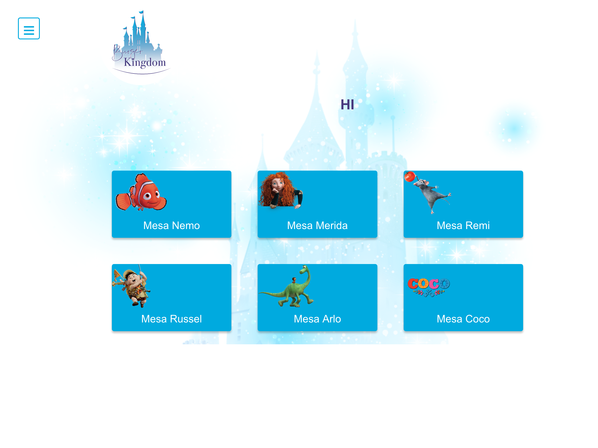
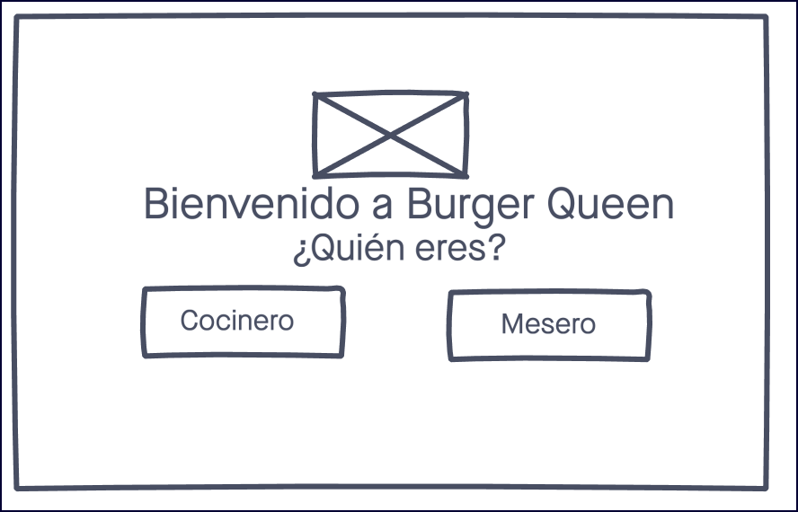
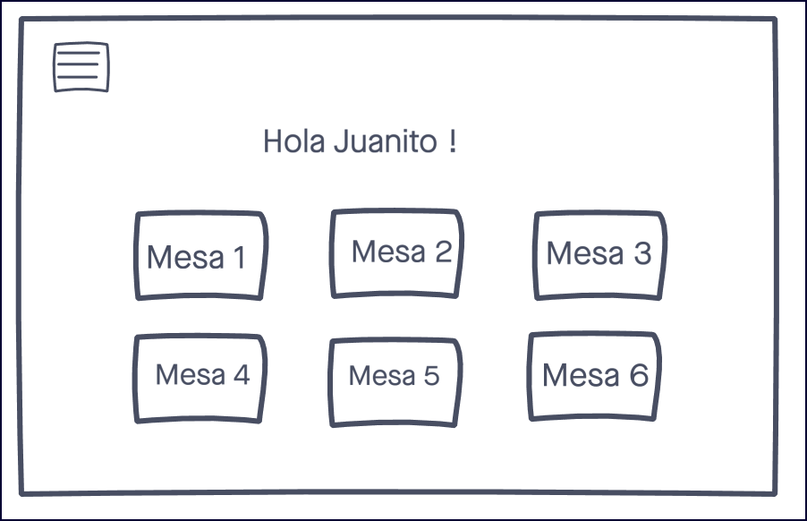
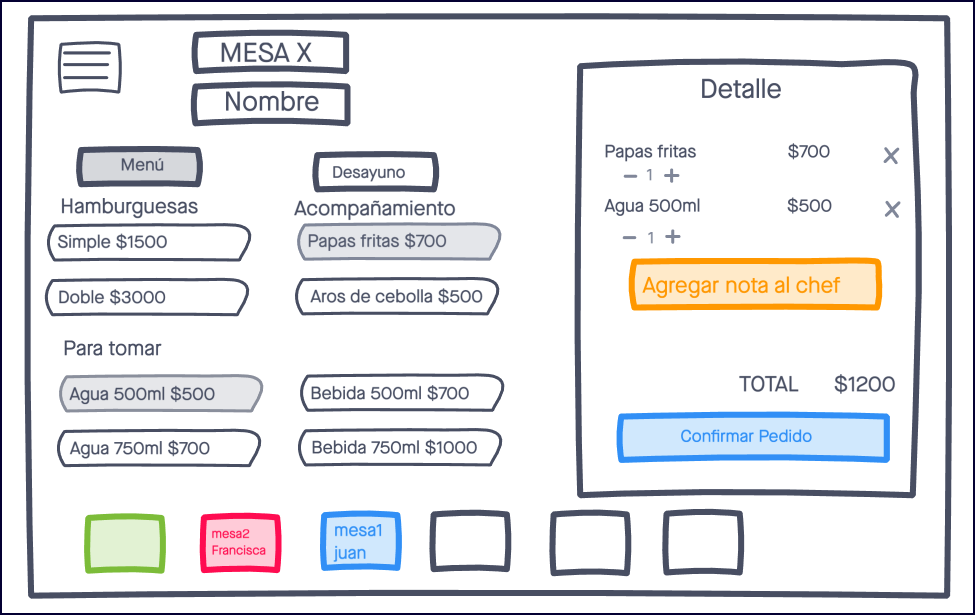
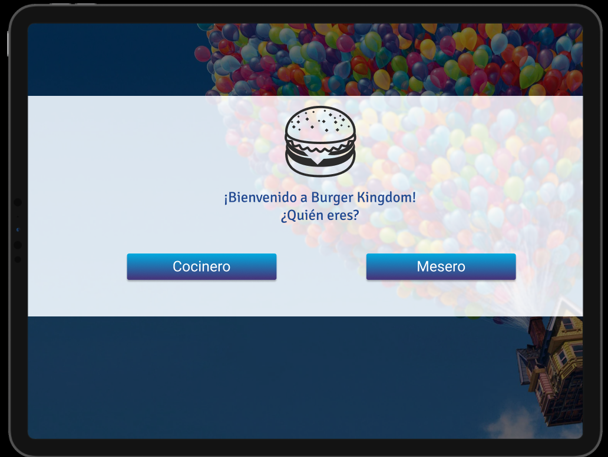
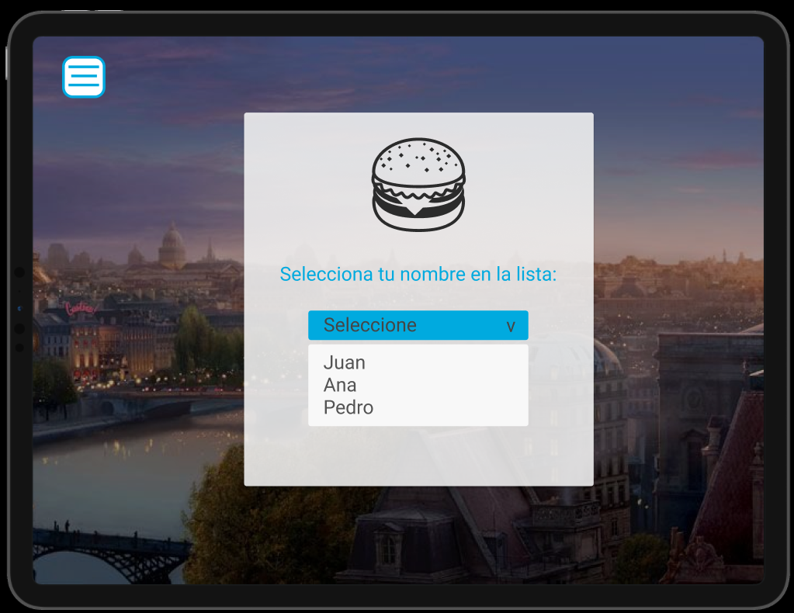
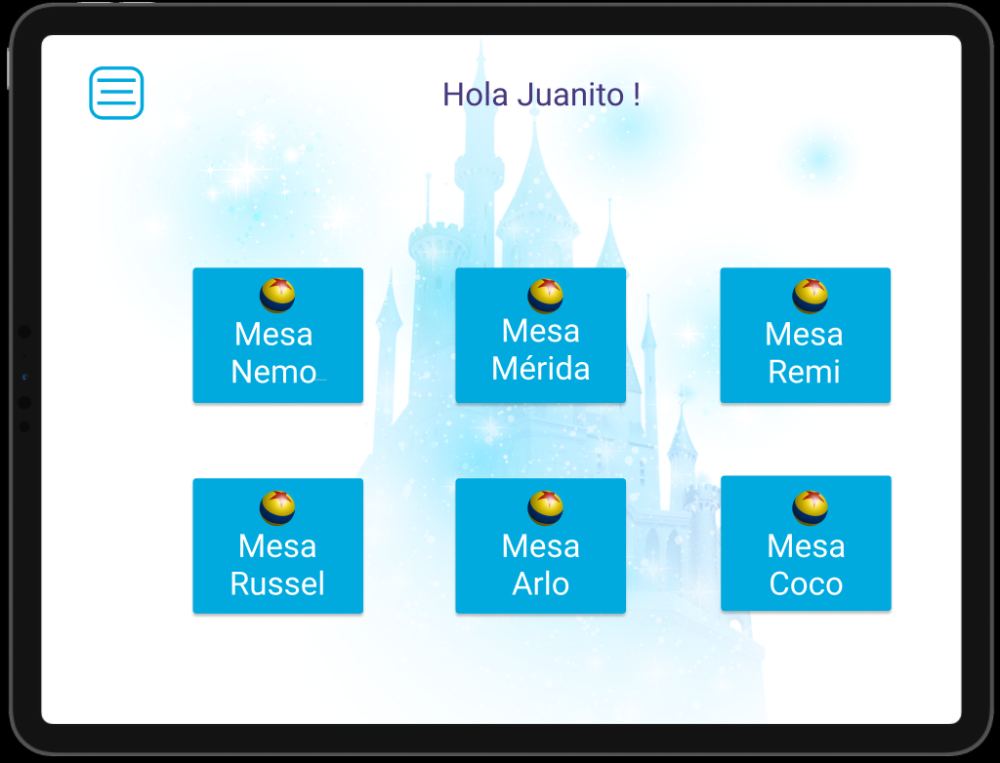
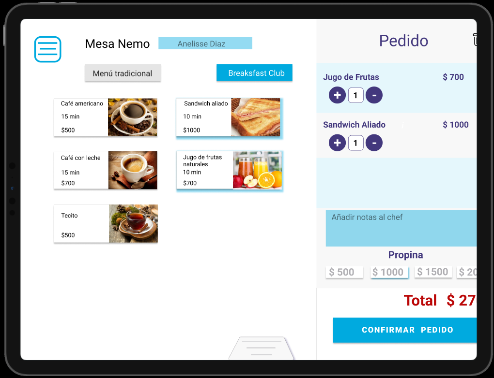
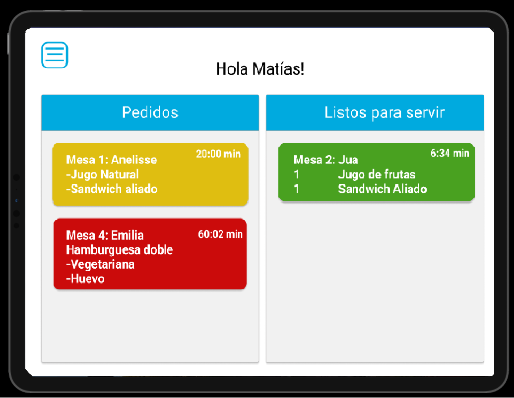
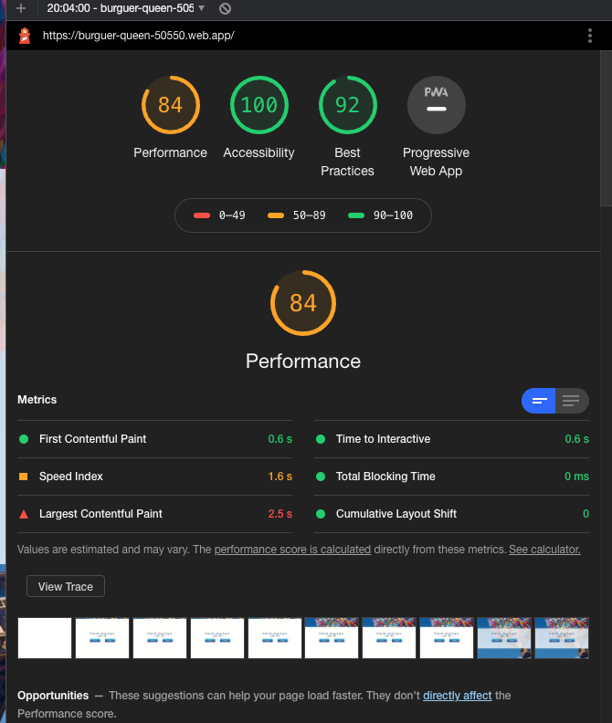

# Burger Kingdom  🏰

## Índice:

* [1. Burger Kingdom.](#1-burger-kingdom.)
* [2. Comenzando a usarla.](#2-comenzando-a-usarla)
* [3. Proceso de protoripado.](#3-proceso-de-protoripado)
* [4. User Research.](#4-user-research)
* [5. Historias de usuario.](#5-historias-de-usuario)
* [6. Objetivos de Aprendizaje.](#6-objetivos-de-aprendizaje)
* [7. Despliegue.](#8-despliegue)
* [8. Herramientas.](#9-herramientas)
* [9. Autoras.](#10-autoras)

***

## 1. Burger Kingdom. :speech_balloon:

Burger Kingdom web app, ha sido creada a partir de la idea de facilitar a meseros y cocineros ta tarea de coordinación de pedidos.
Nuestro proyecto está inspirado directamente en el universo "Disney Pixar", trasladándonos a un local temático, motivo que la aplicación acompaña con imágenes de personajes y referencias a películas emblemáticas del estudio.
La idea de fondo es que la app cuenta con una usabilidad adecuada para todos los trabajadores del local, así evitar errores y mejorar los tiempos de procesos. 
Éste proyecto ha sido desarrollado con React js.
Puedes conocerla y probarla [aquí](https://burguer-queen-50550.web.app).

## 2. Comenzando a usarla 🚀

Burger kingdom es una SPA (Single Page Aplication) pensada y desarrollada para ser utilizada en tablets.
En la primera pantalla podemos seleccionar si entraremos a la app como meseros o como cocineros, porterior a eso, se solicita un inicio de sesión para acceder a todo el contenido (selección de mesas, menú y realización del pedido.).
Puedes acceder a la sección de meseros con el correo electrónico hola@gmail.com y la contraseña 123456 para probarla.

 

## 3. Proceso de prototipado 📋

#### Prototipo de baja fidelidad:
Comenzamos construyendo un prototipo de baja fidelidad en InVision, planificando el flujo de trabajo y todo lo que proyectamos incluír en la web app.
Puedes revisarlo [aquí](https://bqueen.invisionapp.com/freehand/BurguerQ-UZc5k5KE).
  

#### Prototipo de alta fidelidad:
El prototipo de alta fidelidad fue diseñado a través de la plataforma que ofrece Figma, dando énfasis en cómo luciría y el funcionamiento planeado.
Puedes revisarlo [aquí](https://www.figma.com/file/2AZn21VVAc56grSbHWnycN/Burger-Queen?node-id=0%3A1).
    

## 4. User Research :busts_in_silhouette:

En ésta opotunidad se nos entregó un cliente ficticio que debía cubrir la necesidad de una aplicación con las características mencionadas anteriormente, por lo que el equipo se orientó a desarrollar una web app que cubriera sus requerimientos.

Posteriormente, recibimos feedback y aplicamos correcciones recibidas a través de éste ejercicio.

## 5. Historias de usuario ✅
Las Historias de Usuario utilizadas en éste proyecto, fueron las entregadas al comienzo, adaptándolas a nuestra propia app.

Realizamos la planificación a través de la plataforma de [Trello](https://trello.com/invite/b/bwGI8nAq/b4ab1556ec478a5b825f02136326b40a/burguer-queen), por medio de metodología ágil.
.jpg)

## 6. Objetivos de Aprendizaje 🔧
En éste proyecto se nos fue proporcionada una lista de objetivos de aprendizaje que debíamos alcanzar, a continuación se detallan los considerados:

### HTML y CSS

* [x] [Uso de HTML semántico.](https://developer.mozilla.org/en-US/docs/Glossary/Semantics#Semantics_in_HTML)
* [x] Uso de selectores de CSS.
* [x] Construir tu aplicación respetando el diseño realizado (maquetación).
* [x] [Uso de flexbox en CSS.](https://css-tricks.com/snippets/css/a-guide-to-flexbox/)
* [x] [Uso de Media Queries.](https://developer.mozilla.org/es/docs/CSS/Media_queries)

### JavaScript

* [x] Uso de condicionales (if-else | switch | operador ternario)
* [x] Uso de funciones (parámetros | argumentos | valor de retorno)
* [x] Manipular arrays (filter | map | sort | reduce)
* [x] Manipular objects (key | value)
* [x] Uso ES modules ([`import`](https://developer.mozilla.org/en-US/docs/Web/JavaScript/Reference/Statements/import)
| [`export`](https://developer.mozilla.org/en-US/docs/Web/JavaScript/Reference/Statements/export))
* [x] Diferenciar entre expression y statements.
* [x] Diferenciar entre tipos de datos atómicos y estructurados.
* [x] [Uso de callbacks.](https://developer.mozilla.org/es/docs/Glossary/Callback_function)
* [x] [Consumo de Promesas.](https://scotch.io/tutorials/javascript-promises-for-dummies#toc-consuming-promises)

### Testing

* [ ] [Testeo unitario.](https://jestjs.io/docs/es-ES/getting-started)

### Estructura del código y guía de estilo

* [x] Organizar y dividir el código en módulos (Modularización)
* [x] Uso de identificadores descriptivos (Nomenclatura | Semántica)
* [x] Uso de linter (ESLINT)

### Git y Github

* [x] Uso de comandos de git (add | commit | pull | status | push)
* [x] Manejo de repositorios de GitHub (clone | fork | gh-pages)
* [x] Colaboración en Github (branches | pull requests | |tags)
* [x] Organización en Github (projects | issues | labels | milestones)

### Firebase

* [x] [Firestore.](https://firebase.google.com/docs/firestore)
* [x] [Firebase Auth.](https://firebase.google.com/docs/auth/web/start)
* [x] [Firebase security rules.](https://firebase.google.com/docs/rules)
* [ ] Observadores. ([onAuthStateChanged](https://firebase.google.com/docs/auth/web/manage-users?hl=es#get_the_currently_signed-in_user)
 | [onSnapshot](https://firebase.google.com/docs/firestore/query-data/listen#listen_to_multiple_documents_in_a_collection))

### React

* [x] [`JSX`](https://es.reactjs.org/docs/introducing-jsx.html)
* [x] [Componentes `class` y componentes `function`](https://es.reactjs.org/docs/components-and-props.html#function-and-class-components)
* [x] `props`
* [x] [Eventos en React.](https://es.reactjs.org/docs/handling-events.html)
* [x] [Listas y keys.](https://es.reactjs.org/docs/lists-and-keys.html)
* [x] [Renderizado condicional.](https://es.reactjs.org/docs/conditional-rendering.html)
* [x] [Elevación de estados.](https://es.reactjs.org/docs/lifting-state-up.html)
* [x] [`hooks`](https://es.reactjs.org/docs/hooks-intro.html)
* [x] [`CSS` modules.](https://create-react-app.dev/docs/adding-a-css-modules-stylesheet)
* [x] [React Router.](https://reacttraining.com/react-router/web)

### UX

* [x] Diseñar la aplicación pensando y entendiendo al usuario.
* [x] Crear prototipos para obtener feedback e iterar.
* [x] Aplicar los principios de diseño visual (contraste, alineación, jerarquía)
* [x] Planear y ejecutar tests de usabilidad.

***

## 7. Despliegue 📦

Puedes acceder al deploy de nuestro proyecto [aquí](https://burguer-queen-50550.web.app).
Posterior al despliegue hicimos puntuación de performance por medio de Lighthouse de Google, obteniendo todas las puntuaciones por sobre 80% como se nos solicitó.

## 8. Herramientas 🛠️

En éste proyecto fueron utilizadas varias herramientas para llegar al resultado del producto entregado.
Las herramientas usadas fueron:

* [InVision](https://www.invisionapp.com/) – Para el prototipo de baja fidelidad.
* [Figma](https://www.figma.com/) – Para el prototipado de alta fidelidad y testeo en usuarios.
* [Trello](https://trello.com/) – Para la planificación.
* [Firebase](https://firebase.google.com/) – Para la autenticación, base de datos y hosting.
* [Git y GitHub](https://github.com/) – Para el trabajo colaborativo.
* [Lighthouse](https://developers.google.com/web/tools/lighthouse?hl=es) – Para las puntuaciones de Performance.

## 9. Autoras ✒️

Éste proyecto fue realizado en conjunto por alumnas de la generación 14 de Santiago, Chile de Laboratoria.

* **Anelisse Acevedo Sáez** [GitHub](https://github.com/aneacevedo) :octocat:
* **Paula Frías** [GitHub](https://github.com/paupi-chill-e) :octocat:
* **Natalia Quezada** [GitHub](https://github.com/nsquezadam) :octocat:

